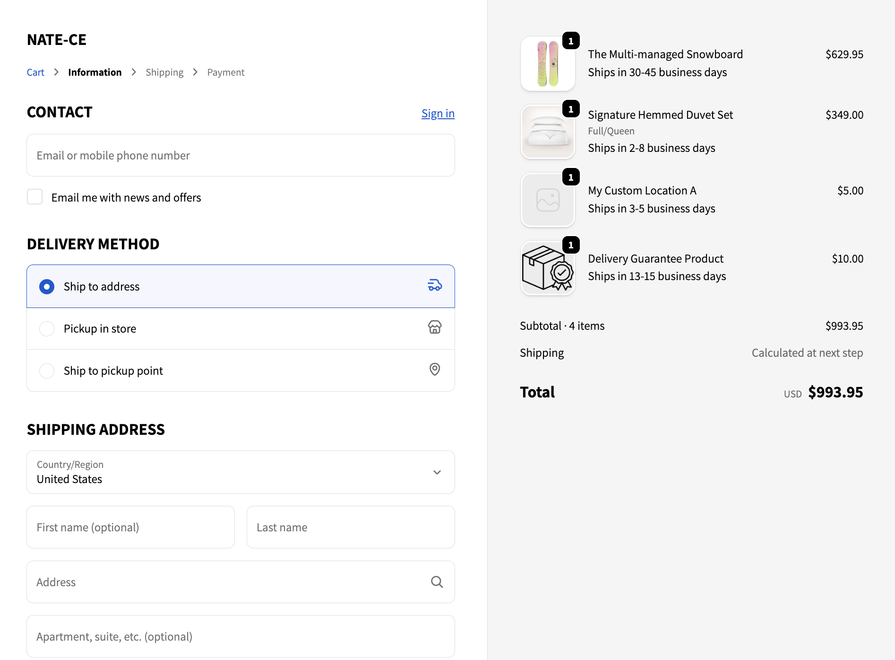

This repository demonstrates the following:

**Create a git repo to push your code to - share with us after the 2 hours is up (should be around 2 hours and 15 minutes from when you received this email)**

This is done.

**Create a Shopify development store (with “Checkout Extensibility” developer preview enabled)**

Dev store has been created and working sample image below demonstrates that the _**NATE-CE**_ store has been created.

**You can import default test data and use Dawn
Create a Checkout UI extension (using React)**

Product data has been imported to the dev store and items have been added to the cart. The sample image below demonstrates this.

**Add a custom product metafield for a shipping delay message Example content: "Ships in 3-5 business days"**

A product metafield has been created. The file path, `extensions/shipping-delay-message/shopify.extension.toml`, has been updated to pull in the newly created product metafield with the key **shipping_delay_message**.

The file path, `extensions/shipping-delay-message/src/Checkout.tsx`, has been updated to fetch this metafield and its value for each cart line item.

**Display the content of this custom metafield in checkout for each product in checkout**

The sample image below demonstrates that there are four distinct products in the cart on the Shopify checkout page. Each product has a different metafield value in the `custom.shipping_delay_message` metafield.

Use your best judgment on the Checkout UI components and placement

The target, `purchase.checkout.cart-line-item.render-after`, was leveraged to accomplish this.

### Metafield in cart lines demo
